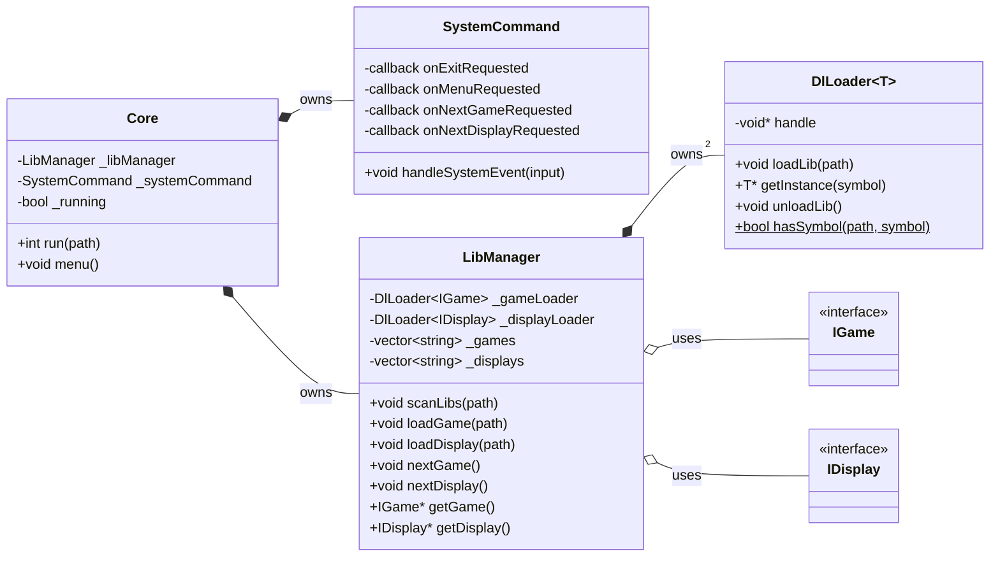
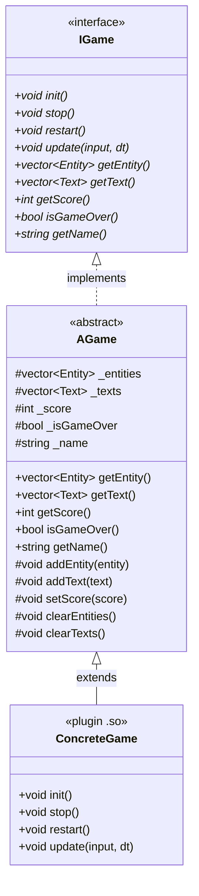
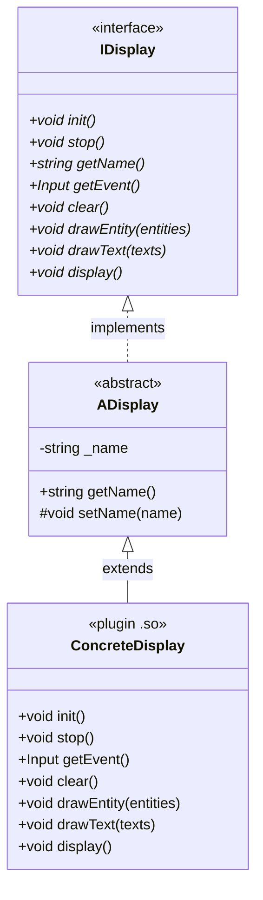
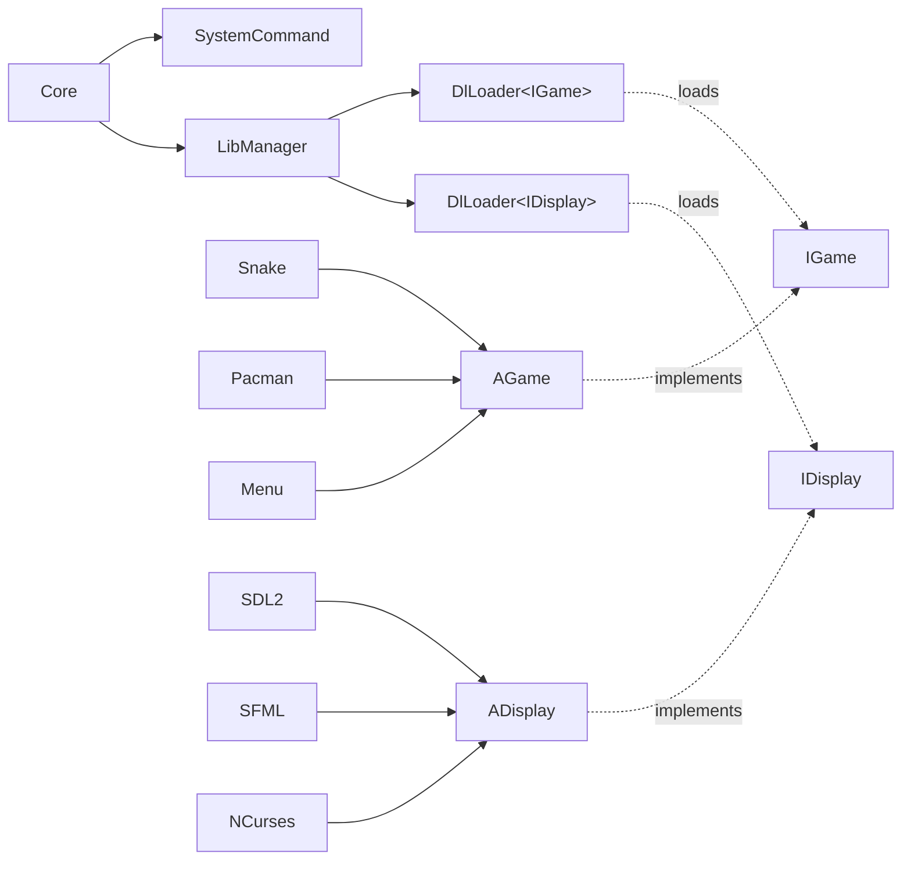
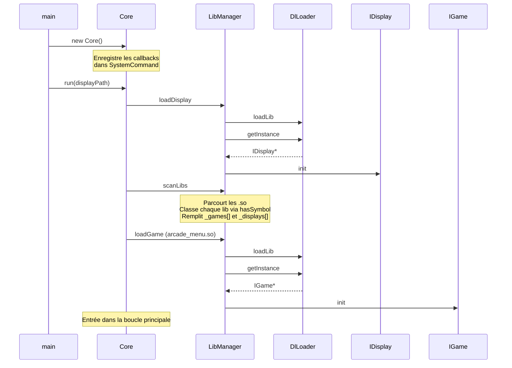
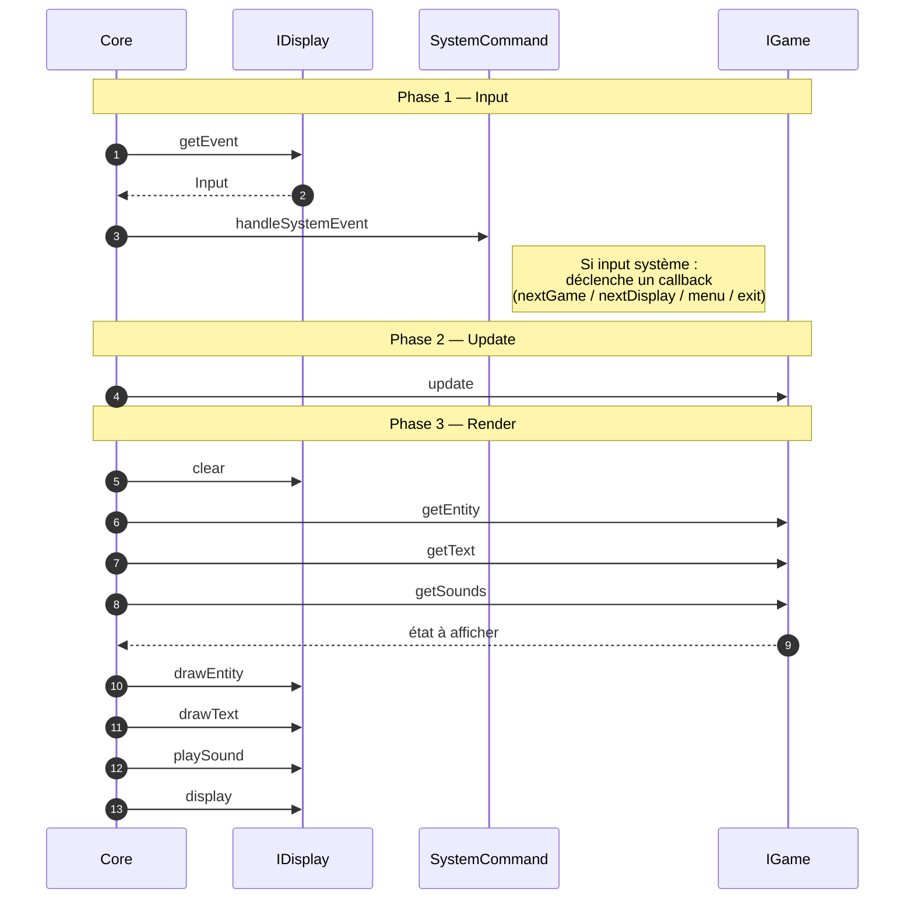
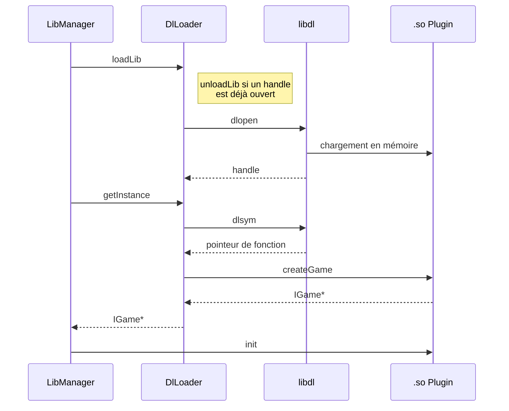
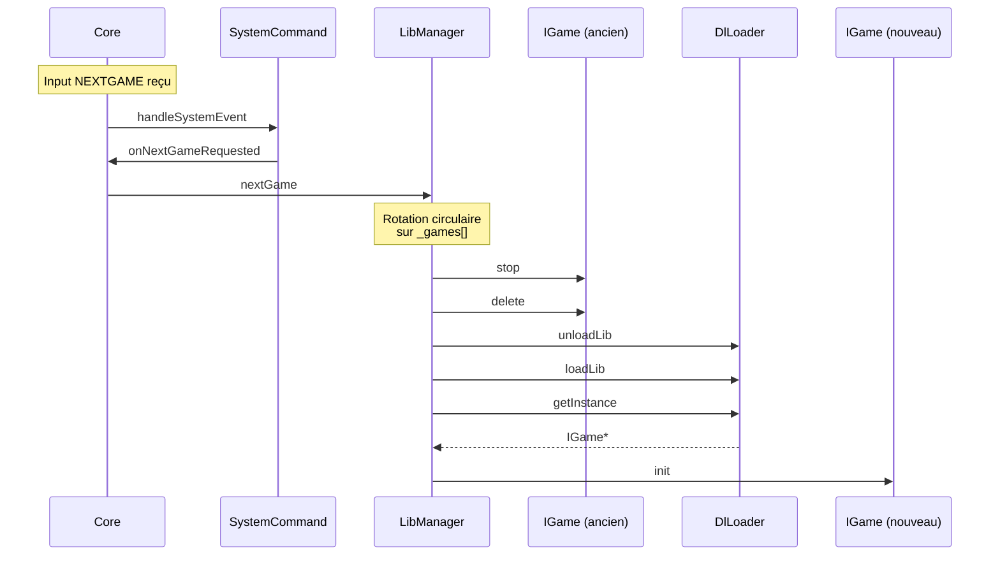
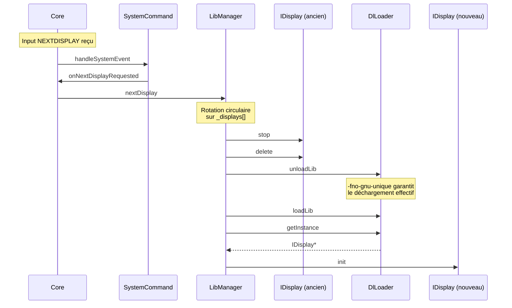
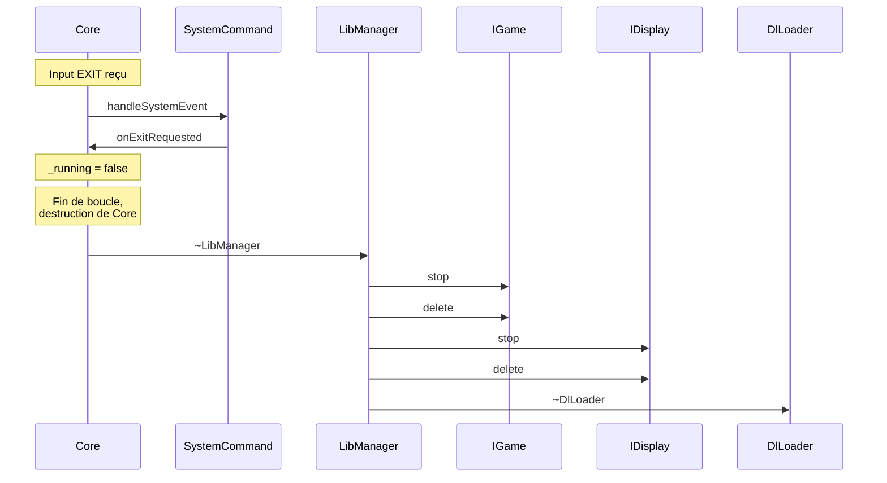

# Arcade — Architecture du Core

## Table des matières

1. [Vue d'ensemble](#1-vue-densemble)
2. [Diagramme de classes](#2-diagramme-de-classes)
3. [Flux de démarrage](#3-flux-de-démarrage)
4. [Boucle principale](#4-boucle-principale)
5. [Chargement d'une librairie dynamique](#5-chargement-dune-librairie-dynamique)
6. [Changement de jeu à chaud](#6-changement-de-jeu-à-chaud)
7. [Changement de librairie graphique à chaud](#7-changement-de-librairie-graphique-à-chaud)
8. [Flux de sortie](#8-flux-de-sortie)
9. [Description des composants](#9-description-des-composants)
10. [Données partagées](#10-données-partagées)
11. [Implémenter une nouvelle librairie](#11-implémenter-une-nouvelle-librairie)

---

## 1. Vue d'ensemble

Le core Arcade est un moteur de plateforme basé sur le **chargement dynamique de plugins** (`.so`).
Il ne connaît jamais les implémentations concrètes des jeux ni des librairies graphiques — il interagit
uniquement via les interfaces `IGame` et `IDisplay`.

```
┌─────────────────────────────────────────────────────┐
│                    arcade (binary)                  │
│                                                     │
│   ┌──────────┐   ┌─────────────┐   ┌─────────────┐ │
│   │   Core   │──▶│ LibManager  │──▶│  DlLoader   │ │
│   └──────────┘   └─────────────┘   └─────────────┘ │
│        │                                   │        │
│        ▼                                   ▼        │
│   ┌──────────────┐              ┌──────────────────┐│
│   │SystemCommand │              │   libdl (dlopen) ││
│   └──────────────┘              └──────────────────┘│
└─────────────────────────────────────────────────────┘
          │                  │
          ▼                  ▼
   ┌────────────┐    ┌─────────────────┐
   │ IGame*.so  │    │  IDisplay*.so   │
   │ (plugins)  │    │   (plugins)     │
   └────────────┘    └─────────────────┘
```

---

## 2. Diagramme de classes

Plutôt qu'un seul schéma surchargé, l'architecture est présentée en **trois vues indépendantes** :
la composition du core, la hiérarchie des jeux et la hiérarchie des displays.
Les interfaces `IGame` et `IDisplay` sont le point de jonction entre ces vues — elles
constituent le contrat avec les plugins `.so`.

### 2.1 Composition du core

Classes et agrégations internes au binaire `arcade`. Les plugins sont volontairement
représentés uniquement par leurs interfaces `IGame` / `IDisplay` : le core ne connaît rien de plus.



> `LibManager` détient **deux** `DlLoader` paramétrés (`DlLoader<IGame>` et `DlLoader<IDisplay>`).
> Ils sont regroupés ici en une seule boîte pour garder le schéma lisible.

### 2.2 Hiérarchie des jeux

Contrat `IGame` et classe abstraite `AGame` mutualisant l'état (entités, texte, score, game over).
Les implémentations concrètes (`Snake`, `Pacman`, `Menu`, …) héritent d'`AGame` et sont chargées dynamiquement via `createGame()`.



### 2.3 Hiérarchie des displays

Même principe côté rendu. `ADisplay` ne fournit que la gestion du nom ;
chaque plugin graphique (`SDL2`, `SFML`, `NCurses`) implémente les méthodes d'affichage.



### 2.4 Vue condensée des dépendances

Pour une lecture rapide des dépendances inter-composants, sans méthodes ni attributs :



---

## 3. Flux de démarrage



---

## 4. Boucle principale

Chaque frame exécute **trois phases successives** sur les plugins courants
(`IGame` et `IDisplay`). Le `LibManager` est re-interrogé entre les phases
car un input système peut avoir remplacé le jeu ou la display pendant le même tour de boucle.

### 4.1 Les trois phases d'une frame

| # | Phase | Qui fait quoi |
|---|---|---|
| 1 | **Input** | `display.getEvent()` → `SystemCommand` dispatche éventuellement vers `LibManager` (next game / next display / menu / exit) |
| 2 | **Update** | `game.update(input, dt)` fait avancer la logique du jeu courant |
| 3 | **Render** | `display.clear()` → `drawEntity` / `drawText` / `playSound` → `display()` |

### 4.2 Pseudo-code

Version simplifiée de `Core::run` (voir `src/core/core.cpp:183`) :

```cpp
while (_running) {
    // --- Phase 1 : Input + commandes système ---
    IDisplay* display = libManager.getDisplay();          // garde-fou
    Input input = display->getEvent();
    systemCommand.handleSystemEvent(input);               // peut charger un autre jeu/display

    // --- Phase 2 : Update du jeu ---
    display = libManager.getDisplay();                    // re-lecture après swap éventuel
    IGame*  game    = libManager.getGame();
    if (game == nullptr) continue;
    game->update(input, deltaTime);

    // --- Phase 3 : Render ---
    display = libManager.getDisplay();                    // re-lecture à nouveau
    display->clear();
    display->drawEntity(game->getEntity());
    display->drawText  (game->getText());
    display->playSound (game->getSounds());
    display->display();
}
```

> **Règle invariante** : après `handleSystemEvent`, `display` et `game` doivent toujours être
> ré-obtenus via `LibManager`. Les pointeurs précédents peuvent être invalides (lib déchargée).

### 4.3 Séquence d'une frame

Diagramme d'une **itération unique** quand aucun événement système n'interrompt le flux :



> Les détails des cas particuliers (`EXIT`, `MENU`, `NEXTGAME`, `NEXTDISPLAY`) sont traités dans
> les sections dédiées [§6](#6-changement-de-jeu-à-chaud), [§7](#7-changement-de-librairie-graphique-à-chaud) et [§8](#8-flux-de-sortie).

---

## 5. Chargement d'une librairie dynamique

Ce diagramme décrit le mécanisme interne de `DlLoader` lors d'un `loadGame` ou `loadDisplay`.



---

## 6. Changement de jeu à chaud

Déclenché par la touche `NEXTGAME` ou `MENU`.



---

## 7. Changement de librairie graphique à chaud

Déclenché par la touche `NEXTDISPLAY`.



---

## 8. Flux de sortie



---

## 9. Description des composants

### `Core`

Point d'entrée de la logique applicative. Orchestre la boucle principale et connecte les callbacks de `SystemCommand` aux actions de `LibManager`.

| Méthode | Rôle |
|---|---|
| `run(path)` | Initialise la display, scanne `./lib`, charge le menu, lance la boucle |
| `menu()` | Recharge `arcade_menu.so` comme jeu courant |
| `loadGame(path)` | Délègue à `LibManager::loadGame` |
| `loadDisplay(path)` | Délègue à `LibManager::loadDisplay` |

---

### `LibManager`

Gère le cycle de vie des plugins (chargement, déchargement, rotation).

| Méthode | Rôle |
|---|---|
| `scanLibs(path)` | Parcourt `./lib`, classe chaque `.so` via `hasSymbol` |
| `loadGame(path)` | Décharge l'ancien jeu, charge le nouveau via `DlLoader<IGame>` |
| `loadDisplay(path)` | Décharge l'ancienne display, charge la nouvelle via `DlLoader<IDisplay>` |
| `nextGame()` | Rotation circulaire dans `_games[]` |
| `nextDisplay()` | Rotation circulaire dans `_displays[]` |

---

### `DlLoader<T>`

Encapsulation C++ de `libdl`. Générique sur le type d'interface.

| Méthode | libdl sous-jacent |
|---|---|
| `loadLib(path)` | `dlopen(path, RTLD_LAZY)` |
| `getInstance(sym)` | `dlsym(handle, sym)` + cast + appel |
| `unloadLib()` | `dlclose(handle)` |
| `hasSymbol(path, sym)` | `dlopen` + `dlsym` + `dlclose` (statique) |

> Le flag `-fno-gnu-unique` (GCC uniquement) est nécessaire pour que `dlclose` décharge
> effectivement la lib. Sans lui, les symboles `GNU_UNIQUE` restent en mémoire.

---

### `SystemCommand`

Traduit les `Input` système en appels de callbacks enregistrés par `Core`.

| Input | Callback déclenché |
|---|---|
| `EXIT` | `onExitRequested` → `_running = false` |
| `MENU` | `onMenuRequested` → charge `arcade_menu.so` |
| `NEXTGAME` | `onNextGameRequested` → `libManager.nextGame()` |
| `NEXTDISPLAY` | `onNextDisplayRequested` → `libManager.nextDisplay()` |

La table de dispatch est un `constexpr std::array` de paires `(Input, méthode*)`, itérée à chaque frame.

---

## 10. Données partagées

Ces structures sont définies dans `src/shared/` et constituent le **contrat de données** entre le core, les jeux et les displays.

### `Input`

```
NONE | UP | DOWN | LEFT | RIGHT | ACTION | MENU | EXIT | RESTART | NEXTGAME | NEXTDISPLAY
```

### `Entity`

```cpp
struct Entity {
    Position position;   // x, y, z (optionnel)
    char asciiChar;      // rendu fallback texte
    string texturePath;  // rendu graphique
    array<uint8_t,4> color; // RGBA
    bool isPlayer;
};
```

### `Text`

```cpp
struct Text {
    Position position;
    string text;
    array<uint8_t,4> color; // RGBA
};
```

---

## 11. Implémenter une nouvelle librairie

### Librairie de jeu

1. Hériter de `AGame`
2. Implémenter `init`, `stop`, `restart`, `update`
3. Utiliser `addEntity`, `addText`, `setScore`, `setIsGameOver` pour exposer l'état
4. Exporter `extern "C" IGame* createGame()`
5. Compiler en `SHARED` → `lib/arcade_<nom>.so`

### Librairie graphique

1. Hériter de `ADisplay`
2. Implémenter `init`, `stop`, `getEvent`, `clear`, `drawEntity`, `drawText`, `display`
3. Appeler `setName(...)` dans `init`
4. Exporter `extern "C" IDisplay* createDisplay()`
5. Compiler en `SHARED` → `lib/arcade_<nom>.so`

### Détection automatique

`LibManager::scanLibs` détecte automatiquement le type via :
- `hasSymbol(path, "createGame")` → classé comme jeu
- `hasSymbol(path, "createDisplay")` → classé comme display
