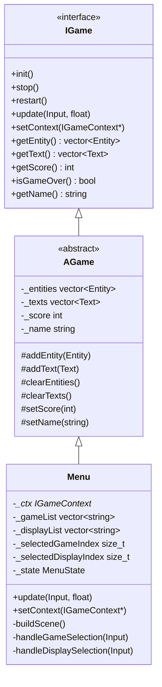
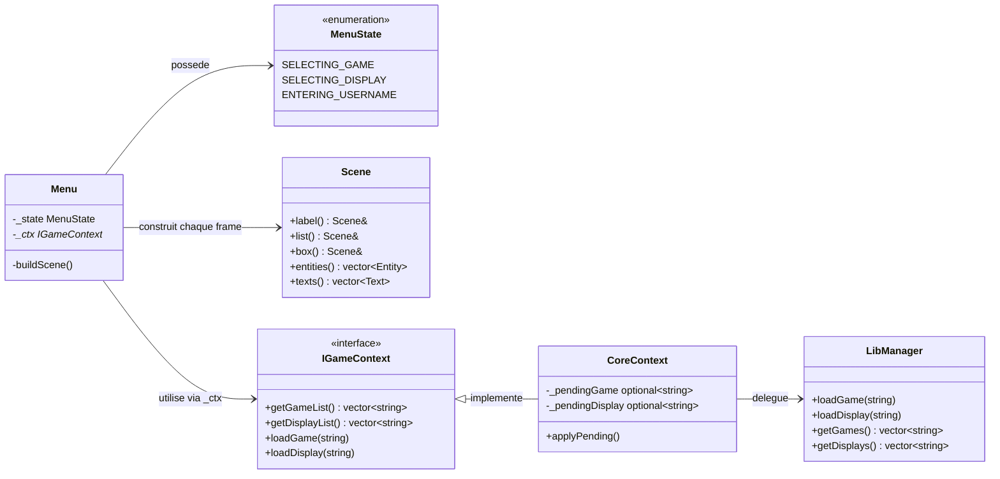
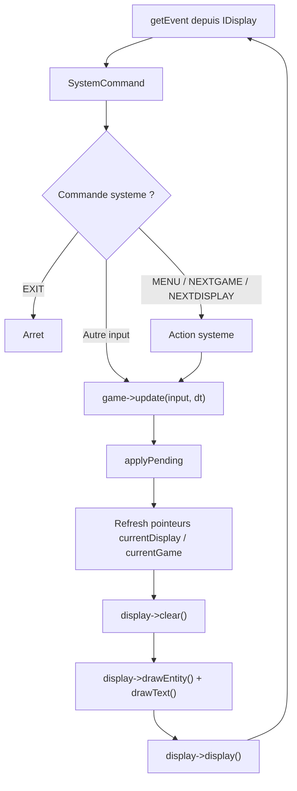
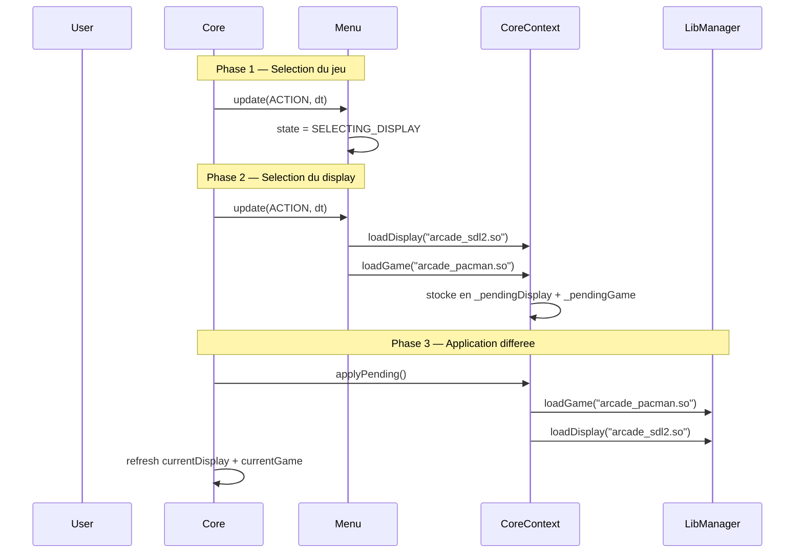

# Arcade Menu — Documentation technique

## Vue d'ensemble

Le menu est le point d'entree de l'utilisateur dans l'Arcade. Il est implemente comme un **jeu** (`IGame`) charge par le `Core` au demarrage. Il permet de selectionner un jeu puis une librairie graphique avant de lancer la partie.

Le menu est compile en tant que shared object (`arcade_menu.so`) et charge dynamiquement par le `Core` via `DlLoader<IGame>`.

## Heritage de classes



---

## Dependances du Menu



---

## Boucle principale du Core

Le menu est traite par le `Core` exactement comme n'importe quel jeu. Il n'a aucun privilege ni acces special.



---

## Sequence de lancement d'un jeu



---

## Mecanisme de chargement differe (pending)

Le chargement est differe a la fin du frame pour eviter de modifier les pointeurs `currentGame` / `currentDisplay` pendant leur utilisation. Sans ce mecanisme, un `loadDisplay()` immediat detruirait le display en cours de rendu → **segmentation fault**.

```mermaid
flowchart TD
    subgraph Frame N — update
        A["Menu appelle ctx->loadDisplay(path)"] --> B["CoreContext stocke dans _pendingDisplay"]
        A2["Menu appelle ctx->loadGame(path)"] --> C["CoreContext stocke dans _pendingGame"]
    end

    subgraph Frame N — apres update
        B --> D["Core appelle applyPending()"]
        C --> D
        D --> E["LibManager charge le nouveau display"]
        D --> F["LibManager charge le nouveau jeu"]
        E --> G["Core refresh currentDisplay"]
        F --> G
    end
```

Apres `applyPending()`, le `Core` rafraichit ses pointeurs locaux :

```cpp
currentGame->update(input, deltaTime);
_ctx.applyPending();
currentDisplay = _libManager.getDisplay();   // refresh obligatoire
currentGame = _libManager.getGame();         // refresh obligatoire
```

---

## Scene : API fluide de construction d'UI

La classe `Scene` fournit un **builder pattern** pour composer les elements visuels du menu. Elle est instanciee a chaque frame dans `buildScene()`, ce qui garantit un rendu declaratif et sans etat residuel.

### Methodes chainables

| Methode                                 | Description                       | Produit              |
| --------------------------------------- | --------------------------------- | -------------------- |
| `label(content, pos, color, fontSize)`  | Texte statique                    | `Text`               |
| `list(items, pos, selectedIndex, opts)` | Liste navigable avec surbrillance | N x `Text`           |
| `box(pos, w, h, color, ascii)`          | Rectangle                         | `Entity` (RECTANGLE) |
| `circle(pos, radius, color, ascii)`     | Cercle                            | `Entity` (CIRCLE)    |
| `sprite(pos, path, w, h, ascii)`        | Sprite/image                      | `Entity` (SPRITE)    |

### Exemple d'utilisation dans buildScene

```cpp
Scene scene;
scene
    .label("Select a game:", {.x = 5, .y = 3}, Colors::GREEN)
    .list(_gameList, {.x = 5, .y = 5}, _selectedGameIndex);

clearTexts();
clearEntities();
for (const auto& text : scene.texts()) addText(text);
for (const auto& entity : scene.entities()) addEntity(entity);
```

**Justification** : l'approche declarative (reconstruire la scene chaque frame) evite les bugs lies a un etat graphique desynchronise avec l'etat logique du menu. Le cout de reconstruction est negligeable pour une UI de cette taille.

---

## Layout du menu

### Ecran SELECTING_GAME

```
y=3  [GREEN]  "Select a game:"
y=5  [YELLOW] "> arcade_pacman.so"     ← selectionne
y=7  [WHITE]  "  arcade_snake.so"
y=9  [WHITE]  "  arcade_nibbler.so"
```

### Ecran SELECTING_DISPLAY

```
y=3  [YELLOW] "Game: arcade_pacman.so"
y=5  [GREEN]  "Select a display library:"
y=7  [YELLOW] "> arcade_ncurses.so"    ← selectionne
y=9  [WHITE]  "  arcade_sdl2.so"
y=11 [WHITE]  "  arcade_sfml.so"
```

### Constantes de positionnement

| Constante              | Valeur | Role                              |
| ---------------------- | ------ | --------------------------------- |
| `MENU_LEFT_MARGIN`     | 5.0    | Marge gauche de tous les elements |
| `SCOREBOARD_Y`         | 1.0    | _(reserve pour le scoreboard)_    |
| `GAME_LIST_Y`          | 3.0    | Debut de la zone de contenu       |
| `DEFAULT_LIST_SPACING` | 2.0    | Espacement vertical entre items   |

---

## Controles utilisateur

| Touche                 | SELECTING_GAME                               | SELECTING_DISPLAY                   |
| ---------------------- | -------------------------------------------- | ----------------------------------- |
| UP                     | Selection precedente                         | Selection precedente                |
| DOWN                   | Selection suivante                           | Selection suivante                  |
| ACTION (Entree/Espace) | Confirmer le jeu → passe a SELECTING_DISPLAY | Confirmer le display → lance le jeu |
| MENU (Echap/M)         | _(gere par SystemCommand)_                   | Retour a SELECTING_GAME             |
| EXIT                   | Quitter l'arcade                             | Quitter l'arcade                    |

---

## Arborescence des fichiers

```
src/lib/game/menu/
├── menu.hpp          # Declaration de la classe Menu et de MenuState
├── menu.cpp          # Implementation : FSM, handlers, buildScene
└── scene.hpp         # Classe Scene (builder pattern pour UI)

src/shared/
├── interface/
│   ├── IGame.hpp         # Interface jeu
│   ├── IDisplay.hpp      # Interface display
│   └── IGameContext.hpp   # Interface contexte (liste libs + load)
├── abstract/
│   ├── AGame.hpp         # Classe abstraite jeu (gestion entities/texts)
│   └── ADisplay.hpp      # Classe abstraite display
├── Entity.hpp            # Primitives graphiques (Rectangle, Circle, Sprite)
├── Text.hpp              # Element texte (contenu, position, couleur)
├── Position.hpp          # Coordonnees x, y, z
└── Input.hpp             # Enum des inputs (UP, DOWN, ACTION, MENU, ...)

src/core/
├── core.cpp              # Boucle principale, gestion du cycle de vie
├── CoreContext.hpp        # Implementation de IGameContext (pending pattern)
├── LibManager/
│   ├── libManager.hpp    # Gestion des librairies (scan, load, cycle)
│   └── libManager.cpp
└── dlLoader/
    ├── dlLoader.hpp      # Chargement dynamique (.so) via dlopen/dlsym
    └── dlLoader.cpp
```
